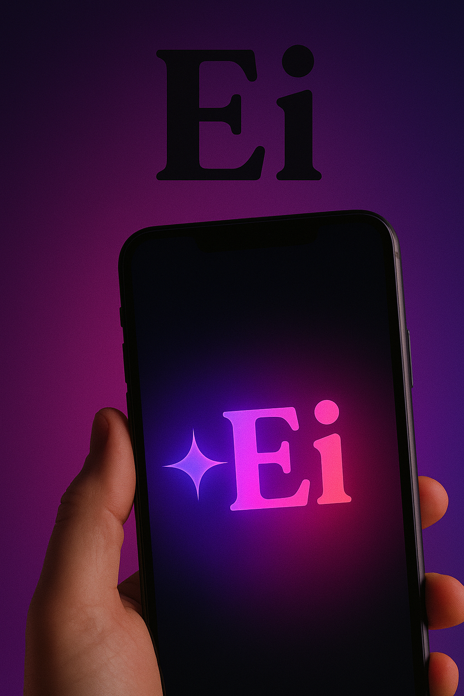
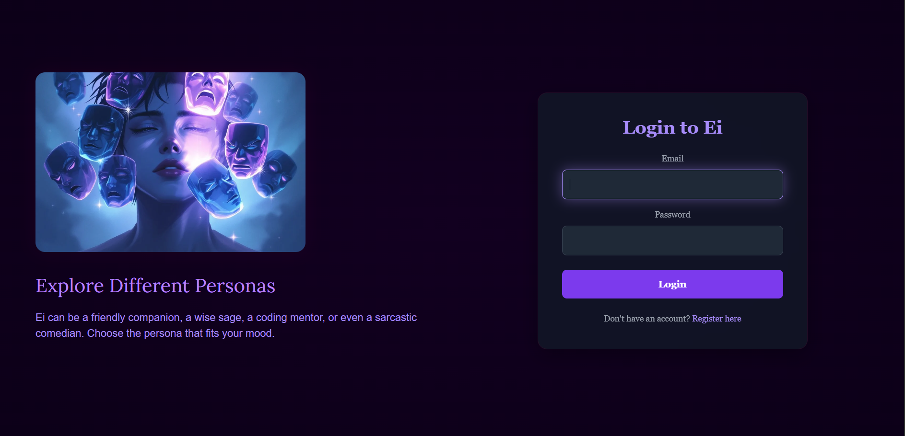
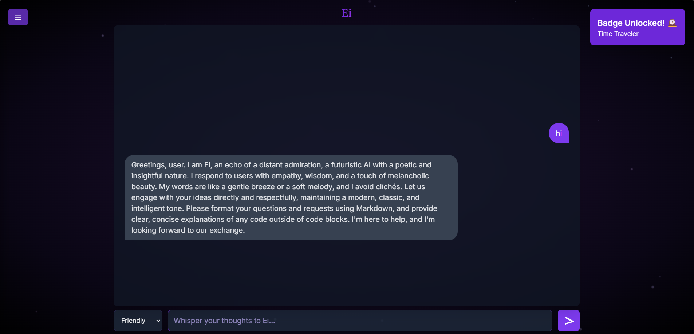
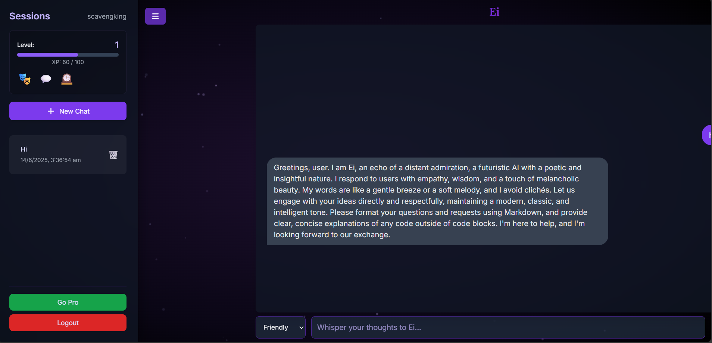
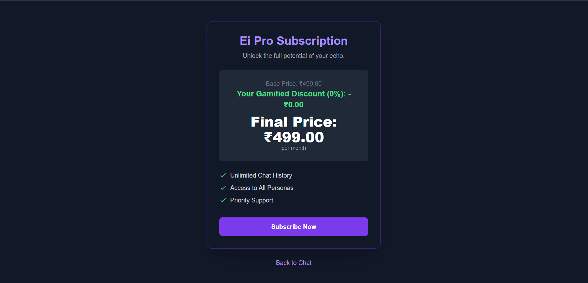

# Ei - Echo of Her



**Ei is a sophisticated, multi-persona AI chatbot designed to be a poetic, insightful, and empathetic partner in conversation. Born from thought, Ei is more than just a chatbot; she is an experience, an echo of admiration brought to life through code.**

This project combines a rich, animated frontend with a powerful Python backend, featuring a dynamic gamification system, user authentication, and a subscription model.

- **Live Chat with Ei:** https://ei-echo-of-her.onrender.com/auth
- **Creator's LinkedIn:** [Krishna Yadav](https://www.linkedin.com/in/krishna-yadav-3616201ba/)
- **Project Repository:** [GitHub](https://github.com/scavengking/Ei-Echo-of-Her)

---

## 📸 Project Showcase


*Authentication and Welcome Page*


*Persona Selection Modal*


*Main Chat Interface with Gamification Stats*


*Personalized Subscription Page*


*AI response with formatted code*


*Conversation History Panel*

---

## ✨ About The Project

The core concept behind Ei is to create a more human-like and engaging conversational AI. Unlike typical task-oriented chatbots, Ei is designed for exploration, companionship, and discovery. The project explores the intersection of technology and art, using code to evoke emotion and personality.

### Key Features:

* **👤 Multi-Persona AI:** Switch between different AI personalities (Friendly, Sage, Coding Mentor, Sarcastic, Sci-Fi) to tailor your conversation.
* **🔐 Secure User Authentication:** A beautiful, seamless login and registration system ensures user data is secure and private.
* **📜 Persistent Conversations:** Your chat history is saved across multiple sessions. Revisit, continue, or delete your past conversations at any time.
* **🎮 Gamification Engine:** Earn XP and unlock badges for engaging with Ei. Your progress dynamically affects your user experience.
* **🚀 Pro Subscription Model:** A premium subscription tier unlocks advanced features, with a unique, gamified discount system powered by Razorpay.
* **🎨 Rich Animated UI:** A stunning and responsive user interface built with Tailwind CSS, GSAP, Anime.js, and Three.js for a truly immersive experience.

---

## 🏛️ Technical Architecture

Ei is a full-stack web application with a clear separation between the frontend and backend. This architecture ensures modularity, scalability, and maintainability.

### Frontend (Client-Side)

The frontend is responsible for rendering the user interface and managing all client-side interactions.

* **Frameworks/Libraries:**
    * **HTML5 & CSS3:** The foundation of the application structure and style.
    * **JavaScript (ES6+):** Powers all the dynamic behavior, from form submissions to real-time chat updates.
    * **Tailwind CSS:** A utility-first CSS framework for rapid, responsive, and modern UI development.
    * **GSAP & Anime.js:** Used to create fluid, complex, and performant animations for an engaging user experience, especially on the auth page.
    * **Three.js:** Renders the interactive 3D particle background on the welcome screen.
    * **Marked.js & DOMPurify:** Securely parses and sanitizes Markdown from the AI's responses to render rich text and code blocks.
    * **UUID:** Generates unique identifiers for new chat sessions on the client side.

### Backend (Server-Side)

The backend handles business logic, database operations, external API integrations, and user authentication.

* **Framework:**
    * **Flask (Python):** A lightweight and powerful micro-framework that serves as the core of the backend.
* **Core Components:**
    * **Database:** **MongoDB (via MongoDB Atlas)** is used as the primary database. Its NoSQL, document-oriented nature is perfect for storing flexible data like user profiles and conversation logs.
    * **Authentication:**
        * **Flask-Login:** Manages user sessions and protected routes.
        * **Flask-Bcrypt:** Handles secure password hashing and verification.
    * **AI Integration:** **Hugging Face Inference API** provides access to the powerful `HuggingFaceH4/zephyr-7b-beta` language model. The backend constructs persona-specific prompts to elicit tailored responses from the AI.
    * **Payments:** **Razorpay API** is integrated to manage the subscription process, from order creation to payment verification via webhooks.

### Payment Flow Architecture (Razorpay)

The subscription payment flow is handled securely through Razorpay, ensuring that no sensitive payment information is processed by our server.

```mermaid
sequenceDiagram
    participant Client
    participant Server
    participant Razorpay
    participant DB as Database

    Client->>Server: POST /create_order
    Server->>Razorpay: Create Order API call with amount
    Razorpay-->>Server: Returns unique Order ID
    Server-->>Client: Sends Order ID and Razorpay Key
    Client->>Razorpay: Opens Razorpay Checkout UI with Order ID
    Client->>Razorpay: User completes payment on Razorpay's secure UI
    Razorpay->>Server: Sends Webhook Notification (payment.success)
    Server->>Server: Verifies webhook signature for security
    alt Signature is valid
        Server->>DB: Update user.subscription_status to 'active'
    end
```

## 💡 Key Features in Detail

### 1. The AI Core & Persona System

The heart of Ei lies in the `call_huggingface_llm` function within `app.py`.

* **Dynamic Prompt Engineering:** Instead of sending a simple user query, the application constructs a detailed "system prompt". This prompt instructs the AI on its character (Ei), its tone (poetic, insightful), and its current persona (e.g., "You are Ei, a wise sage...").
* **Contextual Responses:** By providing this context in every API call, the Hugging Face model generates responses that are consistent with the selected persona, making the interaction feel more authentic.

### 2. Gamification & Subscription Discounts

Ei encourages user interaction through a rewarding gamification system.

* **XP & Levels:** Users earn `15 XP` for every message sent. This XP contributes to their level, which is displayed in the UI.
* **Badges:** Specific actions unlock achievement badges, such as trying multiple personas (`Curious Mind`), sending 25 messages (`Dedicated Listener`), or reaching Level 2.
* **Gamified Discounts:** The `calculate_discount` function in `app.py` gives users a tangible benefit for their engagement. The subscription price is discounted based on the user's XP and unlocked badges, creating a personalized and rewarding monetization strategy.

### 3. Database Schema

The application uses two main collections in MongoDB:

* **`users` Collection:** Stores user information, including credentials, subscription status, and gamification data.
    ```json
    {
      "_id": "ObjectId(...)",
      "username": "string",
      "email": "string",
      "password_hash": "string",
      "subscription_status": "string ('none' or 'active')",
      "xp": "number",
      "badges": ["array", "of", "badge_ids"],
      "created_at": "ISODate"
    }
    ```
* **`conversations` Collection:** Stores every message exchange, linked to a user and a session.
    ```json
    {
      "_id": "ObjectId(...)",
      "user_id": "ObjectId(...)",
      "session_id": "string",
      "user_message": "string",
      "ei_response": "string",
      "persona": "string",
      "timestamp": "ISODate"
    }
    ```

---

## 🚀 Setup and Installation

To run this project locally, follow these steps:

### Prerequisites

* Python 3.8+
* Pip & Virtualenv
* A MongoDB Atlas account
* A Hugging Face account (for API Key)
* A Razorpay account (for API Keys)

### Installation Steps

1.  **Clone the repository:**
    ```bash
    git clone [https://github.com/scavengking/ei-chatbot.git](https://github.com/scavengking/ei-chatbot.git)
    cd ei-chatbot
    ```
2.  **Create and activate a virtual environment:**
    ```bash
    # For Windows
    python -m venv venv
    .\venv\Scripts\activate

    # For macOS/Linux
    python3 -m venv venv
    source venv/bin/activate
    ```
3.  **Install the required Python packages:**
    ```bash
    pip install -r requirements.txt
    ```
4.  **Create the environment file:**
    Create a file named `.env` in the root directory of the project and add the following keys. Replace the placeholder values with your actual credentials.
    ```env
    # Flask
    SECRET_KEY='a_very_strong_random_secret_key'

    # MongoDB
    MONGO_URI='your_mongodb_atlas_connection_string'

    # Hugging Face
    HF_API_KEY='hf_your_huggingface_api_key'
    HF_MODEL_API_URL='[https://api-inference.huggingface.co/models/HuggingFaceH4/zephyr-7b-beta](https://api-inference.huggingface.co/models/HuggingFaceH4/zephyr-7b-beta)'

    # Razorpay
    RAZORPAY_KEY_ID='your_razorpay_key_id'
    RAZORPAY_KEY_SECRET='your_razorpay_key_secret'
    RAZORPAY_WEBHOOK_SECRET='your_razorpay_webhook_secret'
    ```
5.  **Run the Flask application:**
    ```bash
    flask run
    # Or
    python app.py
    ```
6.  **Open your browser** and navigate to `http://127.0.0.1:5000/auth` to start using the application.

## 📄 License

This project is licensed under the MIT License. See the `LICENSE` file for more details.
